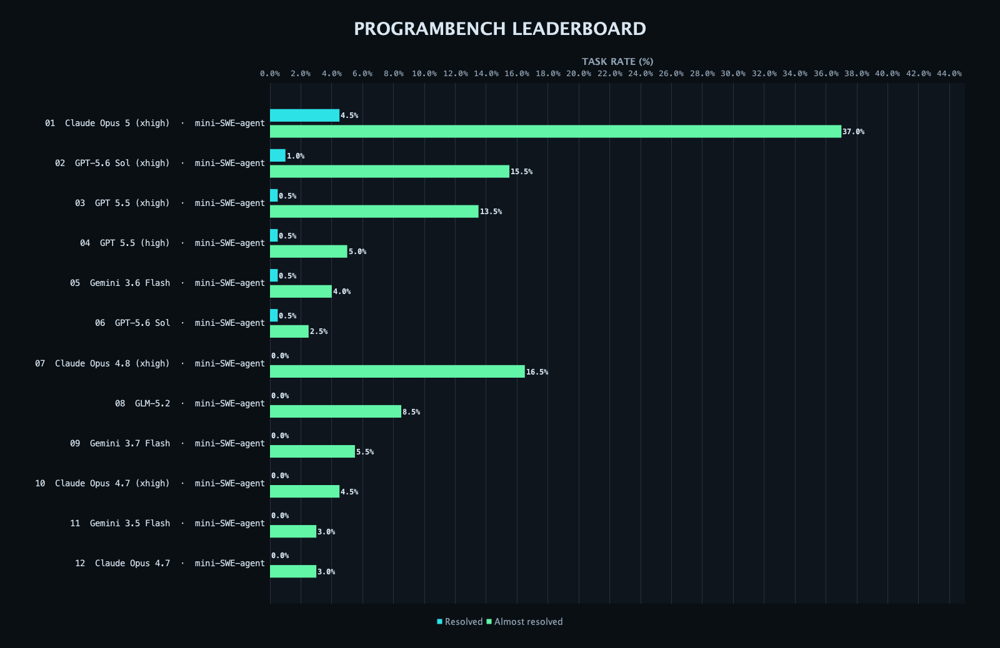
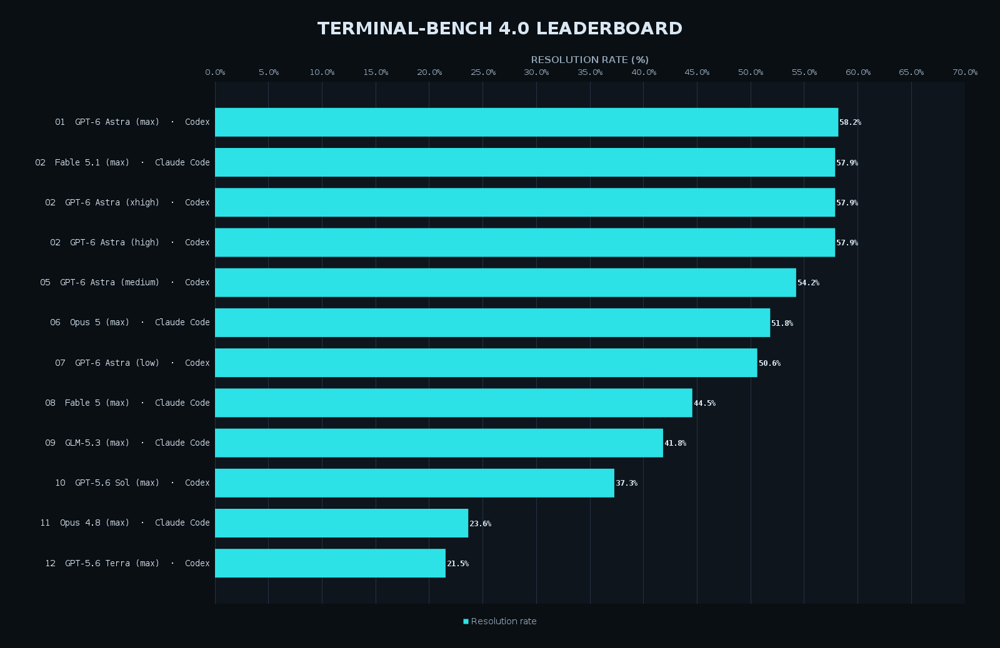

# Benchmark Ladder

[](https://github.com/StaR4y/ai-benchmark-ranking/actions/workflows/update-leaderboards.yml)

本项目会每日抓取以下AI Coding Benchmark数据并每日在仓库更新

- [ProgramBench](https://programbench.com/)
- [FrontierBench](https://www.frontierbench.ai/)（现为 Terminal-Bench 3.0）






项目可作为服务端直接运行，或作为您的项目依赖提供可供直接调用的api

## 构建

环境要求：JDK 21+。仓库已包含官方 Maven Wrapper，无需预装 Maven。

```bash
./mvnw clean package
java -jar target/benchmark-ladder-1.0.0.jar --help
```

## 命令行

读取 JSON：

```bash
java -jar target/benchmark-ladder-1.0.0.jar fetch programbench
java -jar target/benchmark-ladder-1.0.0.jar fetch frontierbench --refresh
```

生成单张图片：

```bash
java -jar target/benchmark-ladder-1.0.0.jar chart programbench \
  --output charts/programbench.png --top 12 --width 1600 --theme dark

java -jar target/benchmark-ladder-1.0.0.jar chart frontierbench \
  --output charts/frontierbench-neon.png --theme neon
```

同时保存两个榜单的稳定 JSON 和图片：

```bash
java -jar target/benchmark-ladder-1.0.0.jar snapshot \
  --output-dir . --theme dark --all-themes --refresh
```

`snapshot` 生成：

```text
data/programbench.json
data/frontierbench.json
charts/programbench.png
charts/frontierbench.png
charts/programbench-{dark,light,neon,mono}.png
charts/frontierbench-{dark,light,neon,mono}.png
```

无后缀的两张图片使用 `--theme` 指定的主题；`--all-themes` 会基于同一次抓取结果额外生成所有带主题后缀的图片，不会重复请求榜单网站。文件型快照不包含每次抓取时间，因此上游内容没有变化时 Git 不会产生无意义 diff。REST 返回值仍包含 `fetchedAt`。

## REST API

```bash
java -jar target/benchmark-ladder-1.0.0.jar serve --port 7070
```

| Method | Path | Description |
|---|---|---|
| `GET` | `/health` | 健康检查 |
| `GET` | `/api/v1/sites` | 支持的站点 |
| `GET` | `/api/v1/chart-themes` | 支持的图片主题 |
| `GET` | `/api/v1/leaderboards/{site}` | 榜单 JSON |
| `GET` | `/api/v1/charts/{site}.png?top=12&width=1600&theme=dark` | PNG 天梯图 |
| `POST` | `/api/v1/refresh/{site}` | 强制刷新并返回 JSON |

`site` 可取 `programbench` 或 `frontierbench`。读取接口也支持 `?refresh=true`。

示例：

```bash
curl http://localhost:7070/api/v1/leaderboards/programbench
curl -o frontierbench.png \
  'http://localhost:7070/api/v1/charts/frontierbench.png?top=10&width=1600&theme=neon'
```

## Java SDK

```java
import io.github.benchmarkladder.BenchmarkLadder;
import io.github.benchmarkladder.chart.ChartOptions;
import io.github.benchmarkladder.chart.ChartTheme;
import io.github.benchmarkladder.model.BenchmarkSite;

BenchmarkLadder ladder = new BenchmarkLadder();
var snapshot = ladder.fetch(BenchmarkSite.PROGRAMBENCH);
byte[] png = ladder.renderPng(
    BenchmarkSite.FRONTIERBENCH,
    new ChartOptions(12, 1600, ChartTheme.NEON));
```

## GitHub Actions Bot

[`.github/workflows/update-leaderboards.yml`](.github/workflows/update-leaderboards.yml) 每天 `01:17 UTC` 自动执行；工作流或 Java 源码更新时也会验证执行，还可从 Actions 页面手动触发。工作流会：

1. 构建并运行 JAR。
2. 每个榜单只抓取一次，并更新 `data/` 与四种风格的 `charts/` 图片。
3. 写入 `data/last-check.json`，记录检查时间、运行链接和榜单条目数。
4. 以 `github-actions[bot]` 身份提交并推送，因此每天都会留下检查记录；榜单 JSON 和图片只在上游内容变化时改变。

工作流只使用仓库自带的 `GITHUB_TOKEN`。仓库设置中需要允许 Actions 写入内容：

`Settings -> Actions -> General -> Workflow permissions -> Read and write permissions`

如果默认分支启用了必须走 PR 的保护规则，应将最后一步改为创建 PR，而不是直接 `git push`。

## 配置

| Environment variable | Default | Description |
|---|---:|---|
| `PORT` | `7070` | REST 服务端口 |
| `CACHE_TTL_MINUTES` | `15` | 内存缓存时间 |
| `REQUEST_TIMEOUT_SECONDS` | `20` | 上游请求超时 |
| `REQUEST_DELAY_MS` | `1000` | 两次上游请求的最小间隔 |
| `CRAWLER_USER_AGENT` | `BenchmarkLadder/1.0 (...)` | 可识别的抓取 User-Agent |

## 抓取策略与维护

- 默认缓存 15 分钟，并限制请求频率。
- 网络失败、HTTP 429 和 5xx 最多重试三次，并指数退避。
- 解析不到有效榜单行时明确失败，避免用空结果覆盖仓库数据。
- ProgramBench 当前未提供 `robots.txt`；FrontierBench 的 `/robots.txt` 当前返回 404。本项目仍采用低频、可识别、只读请求。
- 站点结构或公开接口可能变化。对应适配器位于 `crawler/ProgramBenchCrawler` 与 `crawler/FrontierBenchCrawler`。

请遵守目标网站服务条款，不要把默认限频调成高频采集。本项目与 ProgramBench、FrontierBench、Meta、Harbor Framework 无隶属关系。

## License

[MIT](LICENSE)
